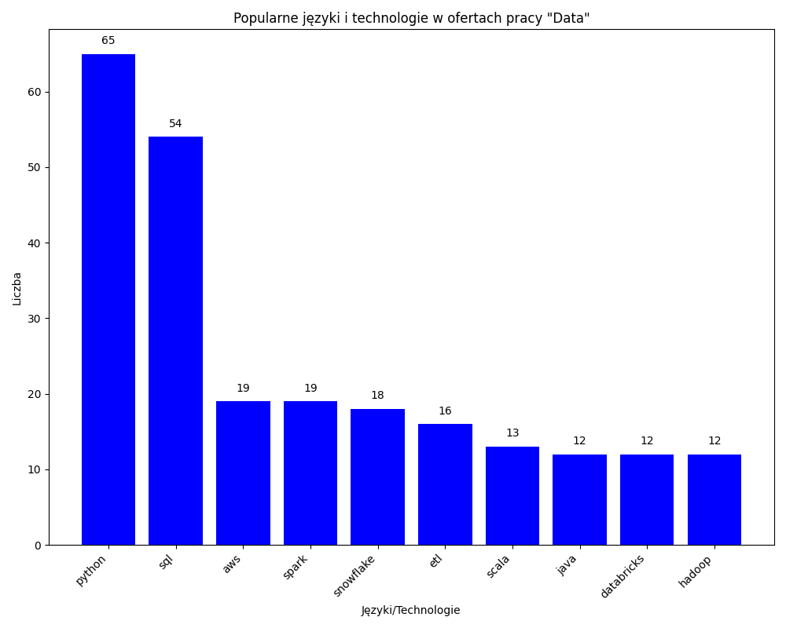
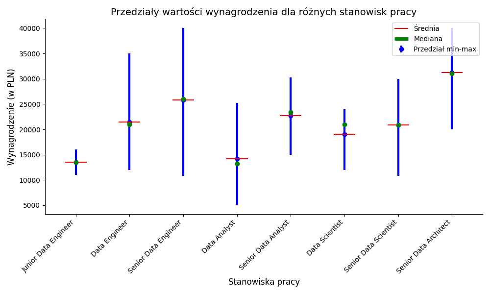
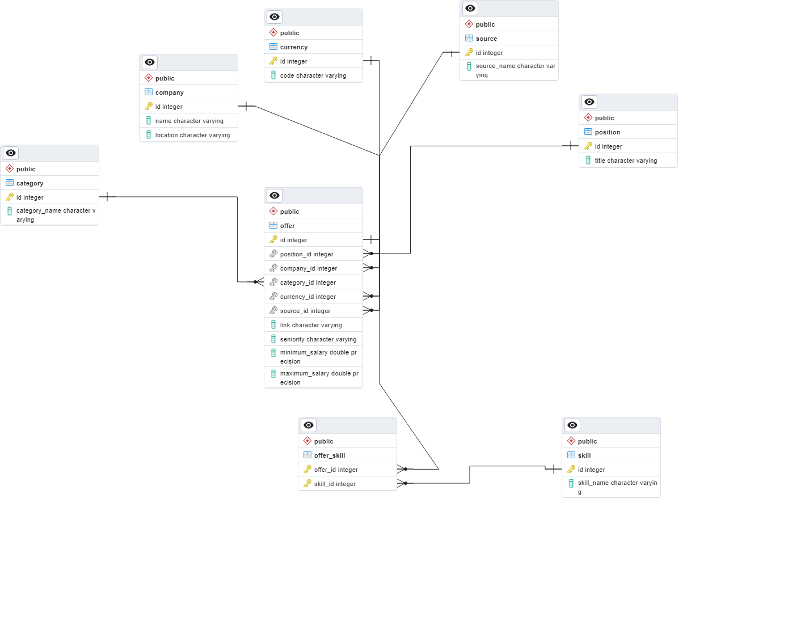

# EDZI_2023_2024_GR_1_Cogiel_Szymon
## [Exercise 1 Introduction to Web Scraping](Cwiczenia_1/)
## [Exercise 2 Web crawler to scrap links based on N-ary tree](Cwiczenia_2/)
Visualization of part scraped data:

## [Exercise 3 Comparison of title popularity between two film databases and NLP Similarity](Cwiczenia_3/)
[Submission file](Cwiczenia_3/submission.json) with data about TOP 100 films. (98% Accuracy)

## [Proj 1 Job offers scrapers for data position](Proj_1/)

Analysis particular scraped data:

## [Proj 2 Extending Project 1 to include API, Database, Docker, LLM and concurrency.](Proj_2/)

Database schema design:

